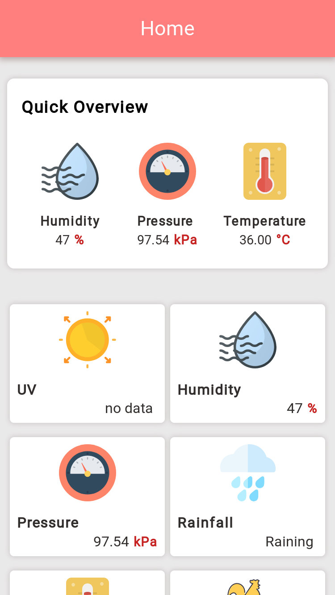
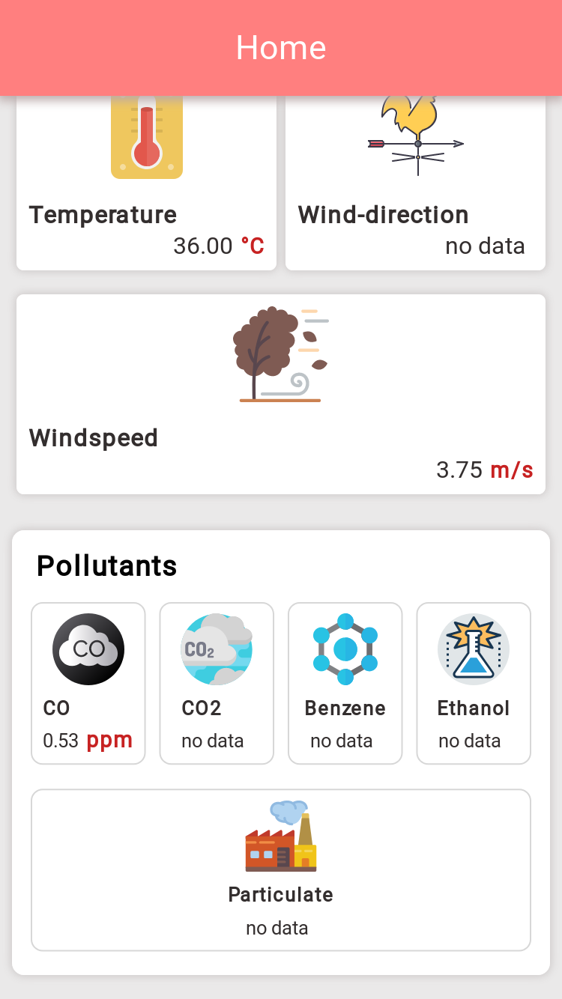
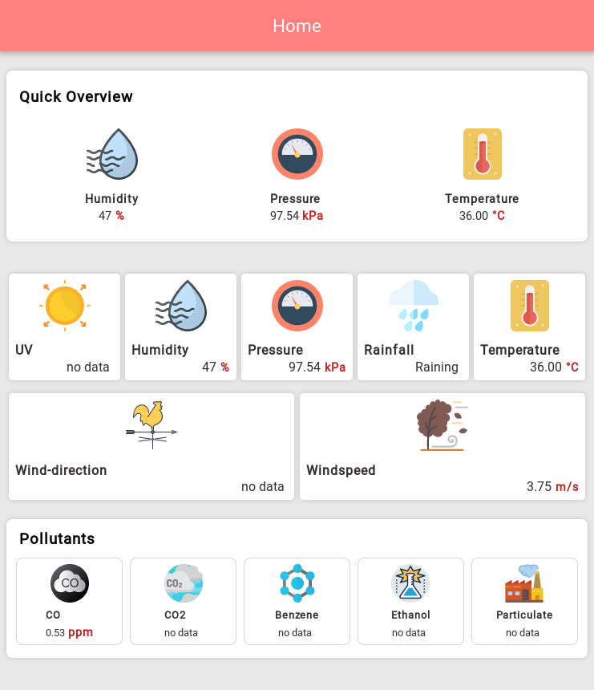

# Weather

This project was generated with [Angular CLI](https://github.com/angular/angular-cli) version 7.0.4.

## Development server

Run `ng serve` for a dev server. Navigate to `http://localhost:4200/`. The app will automatically reload if you change any of the source files.

# Screenshot

# Sample
[Ashesi Weather](https://ashesi-weather.firebaseapp.com/)
